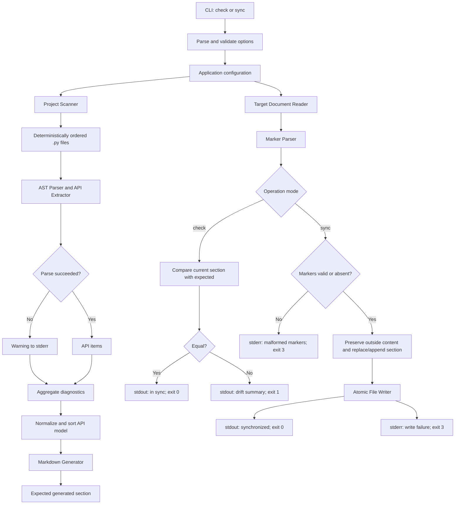

# Automated Documentation Sync Architecture

## 1. Overview

`doc-sync` is a Python CLI that statically analyzes a project tree and keeps a generated public API section synchronized with a Markdown document. The tool never imports or executes scanned source files. It owns only the content between the exact markers:

```markdown
<!-- AUTO-GENERATED:START -->
<!-- AUTO-GENERATED:END -->
```

The architecture is organized as a one-way pipeline:

1. Parse CLI arguments and build a validated configuration.
2. Discover eligible Python files in deterministic order.
3. Parse each file with Python's AST facilities.
4. Extract and normalize public API metadata.
5. Generate deterministic Markdown.
6. Read and validate the target document's marker structure.
7. Compare the expected section for `check`, or replace it atomically for `sync`.
8. Report diagnostics and map the result to the documented exit code.

## 2. Architectural Principles

- **Static analysis only:** source files are parsed, never imported, evaluated, or executed.
- **Deterministic output:** stable path, definition, and member ordering produces byte-for-byte repeatability.
- **Narrow write boundary:** synchronization changes only the generated marker region.
- **Fault isolation:** a syntax error in one source file becomes a warning; valid files continue through the pipeline.
- **Explicit outcomes:** documentation drift, invalid usage, and operational failures have separate exit codes.
- **Testable boundaries:** discovery, extraction, rendering, marker handling, and CLI behavior can be tested independently.

## 3. Component Breakdown

### 3.1 CLI Entrypoint

**Module:** `doc_sync/cli.py`

Responsibilities:

- Define the `doc-sync check` and `doc-sync sync` subcommands.
- Parse `--root`, `--docs`, repeatable `--exclude`, `--verbose`, and `--version`.
- Resolve the project root and target path according to the configured rules.
- Construct the application configuration and invoke the orchestration service.
- Print normal results to `stdout` and diagnostics to `stderr`.
- Map outcomes to exit codes `0`, `1`, `2`, and `3`.

The CLI should remain thin. It should not contain AST traversal or Markdown replacement logic.

### 3.2 Application Orchestrator

**Module:** `doc_sync/application.py`

Responsibilities:

- Coordinate the complete check or sync workflow.
- Pass one immutable configuration through the pipeline.
- Aggregate source diagnostics without losing warnings.
- Ask the renderer for the expected generated section.
- Delegate comparison and updates to the document service.
- Return a structured result that the CLI converts into user-facing output and an exit code.

This is the main dependency-injection boundary for tests.

### 3.3 Project Scanner

**Module:** `doc_sync/scanner.py`

Responsibilities:

- Recursively discover `.py` files below the configured root.
- Exclude hidden directories, virtual environments, `__pycache__`, and user-supplied exclusions.
- Sort paths deterministically.
- Return source-file records containing absolute or root-relative paths and module display paths.
- Avoid reading or parsing files outside the eligible set.

The scanner should use `pathlib.Path` and a directory traversal that can prune excluded directories before descending into them.

### 3.4 Python Parser and API Extractor

**Module:** `doc_sync/parser.py`

Responsibilities:

- Read each discovered file using an explicit encoding policy.
- Call `ast.parse` with the source text; never import the module.
- Catch `SyntaxError`, emit a warning containing the path and location, and skip that file.
- Visit only module-level definitions and class bodies needed by the public API rules.
- Extract public top-level functions, public classes, and public methods.
- Handle async functions as functions while preserving their async signature.
- Include `__init__` only as part of supported public constructor documentation.
- Exclude private definitions, nested functions, and unsupported runtime-generated APIs.
- Extract source-level signatures, annotations, defaults, class bases, docstrings, and source locations without evaluating expressions.

`ast.get_docstring(..., clean=True)` is appropriate for docstring normalization. Signature formatting should be source-safe and should not call `eval` or evaluate annotations/defaults.

### 3.5 Domain Model and Normalizer

**Module:** `doc_sync/model.py`

Responsibilities:

- Define typed records for configuration, source files, API items, diagnostics, and operation results.
- Represent API item kind (`class`, `function`, or `method`), qualified name, signature, bases, docstring, source path, and location.
- Normalize paths and textual fields before comparison or rendering.
- Supply the standard missing-docstring text: `No docstring provided.`
- Provide stable sort keys for modules, classes, functions, and methods.

Normalization belongs before rendering so both `check` and `sync` compare the same canonical representation.

### 3.6 Markdown Generator

**Module:** `doc_sync/markdown.py`

Responsibilities:

- Render the normalized API model into valid, readable Markdown.
- Distinguish modules, classes, functions, methods, signatures, bases, and docstrings.
- Apply one documented heading and formatting convention.
- Use consistent line endings and ensure the generated section ends with a newline.
- Produce identical output for identical normalized API data.

A recommended shape is a module heading followed by class/function entries, with class methods nested under their class. The exact presentation is an implementation contract and should be covered by golden or snapshot-style tests.

### 3.7 Marker Parser and Document Updater

**Module:** `doc_sync/document.py`

Responsibilities:

- Read the target Markdown file without changing it during `check`.
- Locate exactly one start marker and one end marker.
- Distinguish a valid section, absent markers, an absent target, and malformed or ambiguous markers.
- For `check`, return the current generated content for normalized comparison.
- For `sync`, preserve all content outside the markers and replace only the generated region.
- Append a new marker-delimited section when both markers are absent.
- Refuse to update when only one marker exists, markers are reversed, or multiple pairs are ambiguous.
- Create a missing target file for `sync`, including both markers.

This component should expose pure string transformation functions separately from filesystem operations so marker edge cases are easy to test.

### 3.8 Atomic File Writer

**Module:** `doc_sync/io.py`

Responsibilities:

- Write updated documentation through a temporary file in the target directory.
- Flush and close the temporary file before replacing the target with `os.replace`.
- Preserve the original file when a write or replacement fails.
- Report permission, encoding, missing-directory, and other operational failures as structured diagnostics.

The writer must not create a missing target directory unless that behavior is explicitly added to the configuration contract.

### 3.9 Diagnostics and Exit Status

**Modules:** `doc_sync/diagnostics.py`, `doc_sync/exit_codes.py`

Responsibilities:

- Keep warnings, drift summaries, and operational errors structured until presentation.
- Route normal status messages to `stdout` and warnings/errors to `stderr`.
- Support concise output by default and additional per-file/per-definition details in verbose mode.
- Map outcomes to the requirements: `0` success, `1` check drift, `2` invalid CLI/configuration, and `3` operational failure.

## 4. Core Data Flow



### Check Flow

`check` performs discovery, parsing, normalization, rendering, and document inspection entirely in memory. It must never write the target. A missing target, missing generated section, or content mismatch is documentation drift and returns exit code `1`. Malformed marker structure or an operational read failure returns exit code `3`.

### Sync Flow

`sync` performs the same analysis, then creates or updates the target. A missing target is valid for `sync`; a target with no markers receives one appended generated section. A malformed target is rejected without modification. Successful writes use atomic replacement and return exit code `0`.

## 5. Technology Stack

| Area | Choice | Rationale |
|---|---|---|
| Runtime | Python 3.11+ | Explicitly supported modern Python version with stable `ast`, `dataclasses`, and typing APIs. |
| CLI | `argparse` | Built into Python, supports subcommands and repeatable options, and keeps the tool dependency-light for local and CI use. |
| File paths | `pathlib` | Cross-platform path handling for Windows, macOS, and Linux. |
| Source parsing | `ast` | Parses Python without importing modules or requiring project dependencies. |
| Data structures | `dataclasses` and `enum` | Small, typed domain records with clear value semantics. |
| Markdown generation | Standard-library string building | The output format is narrow and deterministic; no template dependency is needed. |
| Comparison | Normalized strings and structured result records | Makes drift detection explicit and reproducible. |
| File safety | `tempfile.NamedTemporaryFile` and `os.replace` | Supports atomic replacement where the operating system permits. |
| Diagnostics | `logging` or a small diagnostic service | Keeps `stdout`/`stderr` routing and verbose behavior consistent. |
| Packaging | `pyproject.toml` with a console-script entry point | Exposes the `doc-sync` command and declares the Python version. |
| Testing | `pytest` | Focused temporary-directory tests for parsing, rendering, marker behavior, and CLI exit codes. |

`click` is a reasonable alternative if richer help formatting, shell completion, or nested command behavior becomes important. For Version 1, `argparse` better matches the lightweight standard-library requirement and avoids making CLI behavior depend on an external package.

## 6. Proposed Repository Structure

```text
 doc-sync-agent/
 |-- pyproject.toml
 |-- README.md
 |-- requirements.md
 |-- architecture.md
 |-- src/
 |   `-- doc_sync/
 |       |-- __init__.py
 |       |-- __main__.py
 |       |-- cli.py
 |       |-- application.py
 |       |-- config.py
 |       |-- diagnostics.py
 |       |-- document.py
 |       |-- exit_codes.py
 |       |-- io.py
 |       |-- markdown.py
 |       |-- model.py
 |       |-- parser.py
 |       `-- scanner.py
 `-- tests/
     |-- conftest.py
     |-- fixtures/
     |   |-- source_projects/
     |   `-- markdown/
     |-- test_scanner.py
     |-- test_parser.py
     |-- test_markdown.py
     |-- test_document.py
     |-- test_application.py
     `-- test_cli.py
```

### Module Ownership

- `config.py`: validated `Configuration` dataclass and default values.
- `scanner.py`: directory traversal and exclusions only.
- `parser.py`: source reading, AST traversal, and extraction only.
- `model.py`: shared domain types and normalization helpers.
- `markdown.py`: API model to generated Markdown.
- `document.py`: marker parsing and pure document transformations.
- `io.py`: filesystem reads and atomic writes.
- `application.py`: workflow orchestration and result aggregation.
- `cli.py` and `__main__.py`: command-line surface only.

## 7. Testing Strategy

- **Scanner tests:** nested files, stable ordering, hidden directories, virtual environments, `__pycache__`, and custom exclusions.
- **Parser tests:** public/private definitions, methods, `__init__`, nested functions, async functions, signatures, bases, docstrings, missing docstrings, decorators, and syntax errors.
- **Generator tests:** deterministic output, normalized docstrings, path formatting, empty API output, and final newline policy.
- **Document tests:** valid markers, absent markers, one marker, reversed markers, duplicate markers, preserved manual content, missing targets, and idempotent replacement.
- **I/O tests:** temporary-file writes, failed writes where practical, target-directory behavior, and preservation of the original document on failure.
- **Application tests:** check exit codes for current/drift/missing/malformed cases and sync behavior for creation/update.
- **CLI tests:** argument defaults, repeatable exclusions, invalid usage, `stdout`/`stderr` routing, `--help`, and `--version`.

All filesystem tests should use temporary directories and files. No test should import or execute a scanned fixture module.

## 8. Important Invariants

1. A source file with a syntax error contributes no API items but does not stop the scan.
2. Generated output is determined only by the normalized source model and configuration.
3. `check` never modifies source or documentation files.
4. `sync` never modifies content outside the generated marker region.
5. A malformed marker structure is never silently repaired or overwritten.
6. Repeating `sync` without source changes is idempotent.
7. The scanner and parser never execute project code or evaluate untrusted expressions.
